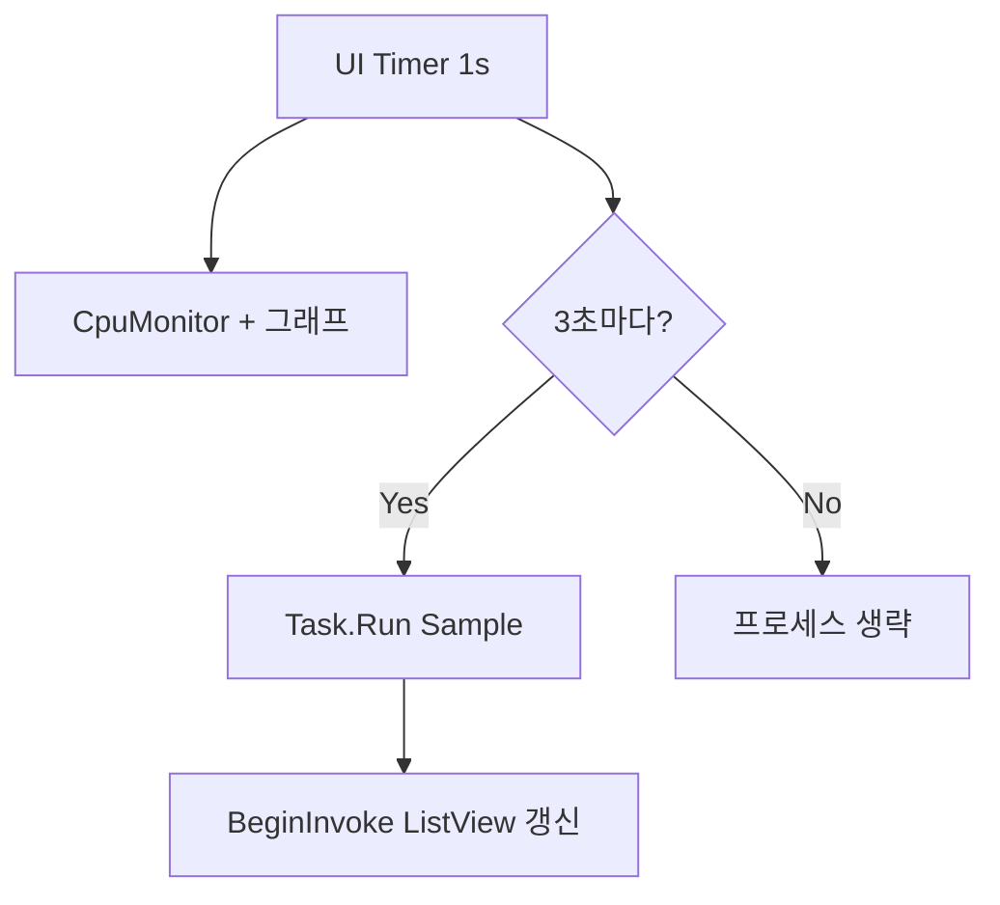

# CPU 점유율 높은 프로세스 목록 확인
_Exported on 5/19/2026 at 10:30:23 GMT+9 from Cursor (3.4.20)_

---

**User**

창이 열렸을 때, CPU를 많이 점유하고 있는 프로세스 목록을 보고 싶어. 어떻게 하는게 좋을까?

---

**Cursor**

프로젝트 구조와 창/UI 흐름을 먼저 파악한 뒤, CPU 점유 프로세스 목록을 어디에 어떻게 보여줄지 제안하겠습니다.


구조 파악 완료. 구현 방향을 정하기 위해 핵심 선택지 두 가지를 확인하겠습니다.


**프로세스 목록 표시 방식**

> **프로세스 목록을 언제/어떻게 갱신할까요?**
> - 창이 열려 있는 동안 주기적으로 갱신 (작업 관리자처럼) ✔
> - 창을 열 때(또는 앱 시작 시) 한 번만 표시
> - 최소화에서 복원할 때마다 갱신

> **목록을 어디에 표시할까요?**
> - 메인 창 하단에 ListView/표로 추가 (창 크기 확대) ✔
> - 별도 팝업/다이얼로그로 표시
> - 메인 창에 접었다 펼 수 있는 섹션으로 추가

선택하신 방향(메인 창 하단 표 + 창이 열려 있는 동안 주기적 갱신)에 맞춰 구현 계획을 작성합니다.


---

**User**

Implement the plan as specified, it is attached for your reference. Do NOT edit the plan file itself.

To-do's from the plan have already been created. Do not create them again. Mark them as in_progress as you work, starting with the first one. Don't stop until you have completed all the to-dos.

---

**Cursor**

계획대로 구현을 시작합니다. `ProcessCpuSampler`부터 추가합니다.


구현을 마쳤습니다. 변경 사항은 다음과 같습니다.

### 신규: `ProcessCpuSampler.cs`
- `GetSystemTimes` + `Process.TotalProcessorTime` 델타로 프로세스별 CPU % 계산
- 접근 불가 프로세스는 건너뜀
- CPU % 내림차순 → 메모리 내림차순으로 상위 N개 반환
- 첫 샘플은 기준선만 저장(약 1초 후 목록 표시)

### `MainForm.cs`
- 하단에 **CPU 상위 프로세스** ListView 추가 (프로세스, PID, CPU %, 메모리)
- 창 크기 `460×520`, 최소 높이 500
- 타이머 tick마다 **창이 최소화되지 않았을 때만** 샘플링·갱신
- **상위 프로세스 수** 설정 (5~30, 기본 10)

### `AppSettings.cs`
- `TopProcessCount` 속성 추가 (`settings.json`에 저장)

빌드는 성공했고, 앱을 3초간 실행해 크래시 없이 동작하는 것을 확인했습니다. 실행 후 약 1~2초 뒤 목록이 채워집니다. CPU 부하가 있는 프로세스를 실행하면 순위가 갱신되고, 최소화 시 샘플링은 중단됩니다.

---

**User**

CPU가 22%정도 표시되는데, 실제로 프로세스 목록의 CPU%를 합하면 22%가 되지 않아. 왜 그런거지?

---

**Cursor**

구현된 CPU 계산 방식을 확인한 뒤, 합이 맞지 않는 이유를 설명하겠습니다.


**상단 CPU 22%**와 **목록에 보이는 프로세스 CPU%의 합**은 같은 숫자가 되도록 설계되어 있지 않습니다. 이 앱 구현 기준으로는 여러 이유가 겹칩니다.

## 1. 서로 다른 지표를 쓰고 있음

상단 **시스템 CPU**(`CpuMonitor`)와 **프로세스 CPU**(`ProcessCpuSampler`)는 같은 `GetSystemTimes`를 쓰지만 **계산식이 다릅니다**.

**시스템 전체 (22%):**

```50:51:d:\Work\TempWork\_ProgrammingProject\WindowsCpuBar\WindowsCpuBar\CpuMonitor.cs
        var busy = total - idleDelta;
        UsagePercent = Math.Clamp(busy * 100.0 / total, 0, 100);
```

→ “전체 CPU 시간 중 **유휴(idle)가 아닌 비율**”

**프로세스별:**

```84:84:d:\Work\TempWork\_ProgrammingProject\WindowsCpuBar\WindowsCpuBar\ProcessCpuSampler.cs
                    var cpuPercent = 100.0 * processDelta / systemDelta / processorCount;
```

→ `systemDelta = kernel + user` (idle을 빼지 않음) + **코어 수로 한 번 더 나눔**

분모·분자 정의가 달라서, 이론적으로도 “목록 합 = 상단 %”가 성립하지 않습니다.

---

## 2. 목록은 **상위 N개만** 보여줌 (가장 큰 이유)

```136:142:d:\Work\TempWork\_ProgrammingProject\WindowsCpuBar\WindowsCpuBar\ProcessCpuSampler.cs
    public IReadOnlyList<ProcessCpuEntry> GetTopProcesses(int count)
    {
        return _lastEntries
            .OrderByDescending(e => e.CpuPercent)
            .ThenByDescending(e => e.WorkingSetBytes)
            .Take(count)
```

기본값은 **상위 10개**입니다.  
22%는 **전체 시스템** 사용률이고, 목록은 **CPU를 많이 쓰는 10개만** 보여 줍니다.

나머지 수백 개 프로세스(백그라운드 서비스, 드라이버, 짧게 깨어난 프로세스 등)의 CPU는 목록에 없지만, 상단 22%에는 포함됩니다.  
그래서 **목록 합이 22%보다 훨씬 작은 경우**가 일반적입니다.

작업 관리자에서도 “프로세스 탭 각 항목을 더하면 100%”가 아닙니다. 상단은 전체, 목록은 일부입니다.

---

## 3. 측정되지 않는 CPU가 있음

`Process.GetProcesses()` 루프에서 `catch`로 건너뛰는 프로세스:

```94:97:d:\Work\TempWork\_ProgrammingProject\WindowsCpuBar\WindowsCpuBar\ProcessCpuSampler.cs
                catch
                {
                    // Skip inaccessible processes.
                }
```

- 권한이 없는 **시스템/다른 사용자** 프로세스  
- 순간적으로 끝난 프로세스  
- 첫 샘플이라 기준선만 잡힌 프로세스 (`continue`로 목록 제외)

이들의 CPU는 **상단 22%에는 들어가지만 목록에는 없습니다.**

---

## 4. 멀티코어에서는 “합” 개념이 애매함

여러 코어에서 동시에 돌면, 프로세스별 %는 **전체 CPU 용량(논리 프로세서 수) 대비**로 잡히는 경우가 많습니다.

- 한 프로세스가 코어 2개를 꽉 쓰면 → 목록에는 **한 줄이지만** 실제로는 2코어 분량  
- 반대로 여러 프로세스가 조금씩 쓰면 → 각각은 낮은 %인데 합치면 상단 %에 가까워질 수 있음  

그래서 “목록 숫자를 단순 합산 = 전체 사용률”이라는 직관이 Windows CPU 표시와는 맞지 않습니다.

---

## 5. 샘플링 시점도 완전히 같지 않음

`OnTimerTick`에서 `_cpuMonitor.Sample()` 직후 `_processSampler.Sample()`을 호출합니다. 각각 **자기 기준선**으로 `GetSystemTimes`를 따로 읽기 때문에, 같은 1초 구간이라도 미세하게 어긋날 수 있습니다. (보통은 2번째 이유보다 영향이 작습니다.)

---

## 정리

| 원인 | 효과 |
|------|------|
| 상위 N개만 표시 | 합이 **22%보다 작음** (가장 흔함) |
| 접근 불가 프로세스 누락 | 합이 **더 작음** |
| 시스템 vs 프로세스 **계산식 차이** | 합과 22%가 **1:1로 맞지 않음** |
| 멀티코어 / 동시 실행 | 단순 합산으로 해석하기 어려움 |

**22%는 “지금 PC 전체가 얼마나 바쁜지”**이고, **목록은 “그중에서 특히 바쁜 프로세스 몇 개”**라고 보면 됩니다.  
합이 22%에 가깝게 맞추고 싶다면(구현 변경 시): **모든 프로세스**를 합산하거나, 목록 하단에 **“기타 / 측정 불가”** 행을 두는 방식이 필요합니다. Agent 모드로 전환하시면 그 방향으로 수정안도 제안할 수 있습니다.

---

**User**

창이 떠 있을 때, 프로세스 목록을 갱신하는 것 때문에 UI 반응이 느려 졌어. 어떻게 하면 좋을까?

---

**Cursor**

타이머와 프로세스 샘플링이 UI 스레드에서 어떻게 돌아가는지 확인 중입니다.


습
느려진 이유는 **프로세스 목록 갱신이 UI 스레드에서, CPU 그래프와 같은 주기(기본 1초)로 전체 프로세스를 훑기 때문**입니다.

```309:312:d:\Work\TempWork\_ProgrammingProject\WindowsCpuBar\WindowsCpuBar\MainForm.cs
            if (WindowState != FormWindowState.Minimized)
            {
                _processSampler.Sample();
                UpdateProcessList();
```

`Process.GetProcesses()`는 프로세스가 수백 개일 때마다 **객체 생성 + 핸들 열기 + `TotalProcessorTime` / `ProcessName` / `WorkingSet` 조회**가 한꺼번에 일어나고, WinForms `Timer`는 이 작업이 끝날 때까지 **창 이동·리사이즈·클릭이 막힙니다.**

---

## 권장 대응 (효과 큰 순)

### 1. 프로세스 목록만 갱신 주기 늘리기 (가장 쉬움)

시스템 CPU 그래프는 1초, **목록은 2~5초**처럼 분리합니다.

```csharp
// OnTimerTick 안에서 예시
_processListTick++;
if (WindowState != FormWindowState.Minimized && _processListTick >= 3)
{
    _processListTick = 0;
    _processSampler.Sample();
    UpdateProcessList();
}
```

체감 반응성은 바로 좋아지고, 목록도 작업 관리자처럼 “몇 초마다” 갱신해도 충분합니다. 설정에 **「프로세스 목록 갱신 (초)」**을 두면 더 좋습니다.

---

### 2. 샘플링을 백그라운드로 옮기기 (근본 해결)

`Sample()`만 `Task.Run`으로 돌리고, 끝나면 `BeginInvoke`로 `UpdateProcessList()`만 UI에서 실행합니다.

```text
UI Timer (1s) → CpuMonitor + 그래프 (가벼움, UI 스레드)
              → 3초마다 Task.Run(ProcessCpuSampler.Sample)
                    → 완료 시 BeginInvoke(UpdateProcessList)
```

주의할 점:
- `_baselines` 딕셔너리는 **한 스레드에서만** 쓰거나 `lock`으로 보호
- UI가 닫힐 때 진행 중인 `Task` 취소 (`CancellationToken`)
- 타이머보다 샘플링이 길면 **겹치지 않게** `if (_isSampling) return;` 플래그

이렇게 하면 목록 갱신 중에도 창 드래그·설정 변경이 버벅이지 않습니다.

---

### 3. ListView 전체 삭제·재생성 줄이기 (보조)

지금은 매번 `Items.Clear()` 후 전 행을 다시 만듭니다.

```330:333:d:\Work\TempWork\_ProgrammingProject\WindowsCpuBar\WindowsCpuBar\MainForm.cs
        _processListView.BeginUpdate();
        try
        {
            _processListView.Items.Clear();
```

- 행 수가 고정(상위 10개)이면 **PID 기준으로 텍스트만 갱신**
- 순위가 바뀔 때만 행 순서 변경

비용의 대부분은 `Sample()` 쪽이지만, UI 쪽 깜빡임·미세 끊김은 줄어듭니다.

---

### 4. 열거 비용 자체 줄이기 (선택, 구현 난이도 ↑)

| 방법 | 설명 |
|------|------|
| 프로세스 목록 캐시 | `GetProcesses()`는 5초에 한 번, 그 사이에는 **이전 PID 집합**만 `TotalProcessorTime` 갱신 |
| WMI / PerformanceCounter | 초기화·인스턴스 관리 부담, 이 앱 규모에는 보통 비추 |
| Win32 `CreateToolhelp32Snapshot` | `Process` 객체보다 가벼울 수 있으나 P/Invoke 증가 |

“전체 프로세스 매 초”가 병목이므로, **2번(백그라운드) + 1번(주기 분리)**만 해도 대부분 해결됩니다.

---

## 이 앱에 맞는 조합 제안



1. **프로세스 목록 갱신 3초 간격** (설정 가능)  
2. **`Sample()`은 백그라운드**, UI는 결과만 반영  
3. 여유 있으면 ListView **차분 갱신**

시스템 CPU 표시는 그대로 1초로 두어도 됩니다.

---

## 피하면 좋은 것

- 목록을 더 자주(500ms) 갱신 — 오히려 더 느려짐  
- `async void`로 `Sample()`만 비동기 호출 후 UI에서 바로 `UpdateProcessList` — 여전히 UI 스레드에서 무거운 작업이 돌 수 있음  
- `Process.GetProcesses()`를 UI 스레드에 그대로 두고 주기만 약간 줄이기 — 3초로 해도 200~300개 프로세스면 가끔 끊길 수 있음  

---

정리하면, **갱신 주기 분리(빠른 효과) + 백그라운드 샘플링(근본)**이 가장 현실적입니다. Agent 모드로 전환하시면 위 조합으로 코드 수정까지 진행할 수 있습니다.

---

**User**

버튼을 눌렀을 때만 process를 sampling해서 목록을 update해 줘.

---

**Cursor**

타이머 자동 갱신을 제거하고, 버튼 클릭 시에만 프로세스를 샘플링·목록 갱신하도록 변경합니다.


타이머에서 자동 샘플링을 제거하고, '새로고침' 버튼 클릭 시에만 백그라운드에서 샘플링하도록 변경합니다.


변경을 반영했습니다.

### 변경 사항
- **타이머**에서는 CPU 그래프만 갱신하고, 프로세스 샘플링은 하지 않습니다.
- **「목록 새로고침」** 버튼을 추가했습니다 (프로세스 목록 라벨 오른쪽).
- 버튼을 누르면:
  1. 백그라운드에서 `Sample()` 실행 (UI 멈춤 방지)
  2. 첫 새로고침이면 갱신 주기만큼 대기 후 한 번 더 `Sample()` (기준선 확보)
  3. 이후에는 이전 기준선으로 한 번만 샘플링해 목록 갱신
- 처리 중에는 버튼 비활성화 + 대기 커서 표시

CPU 그래프는 이전과 같이 자동 갱신되고, 프로세스 목록은 버튼을 눌렀을 때만 갱신됩니다.

